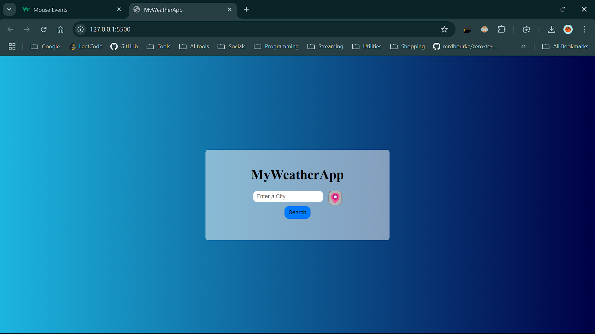
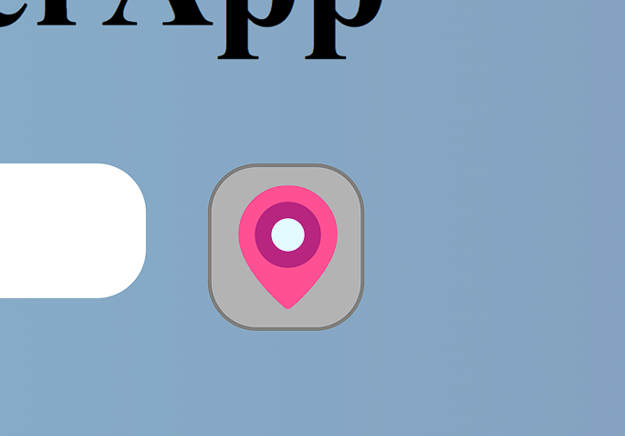
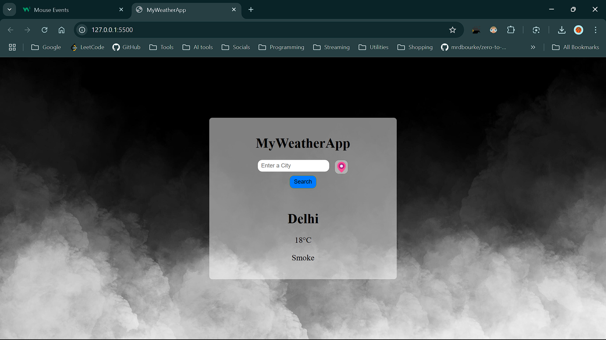
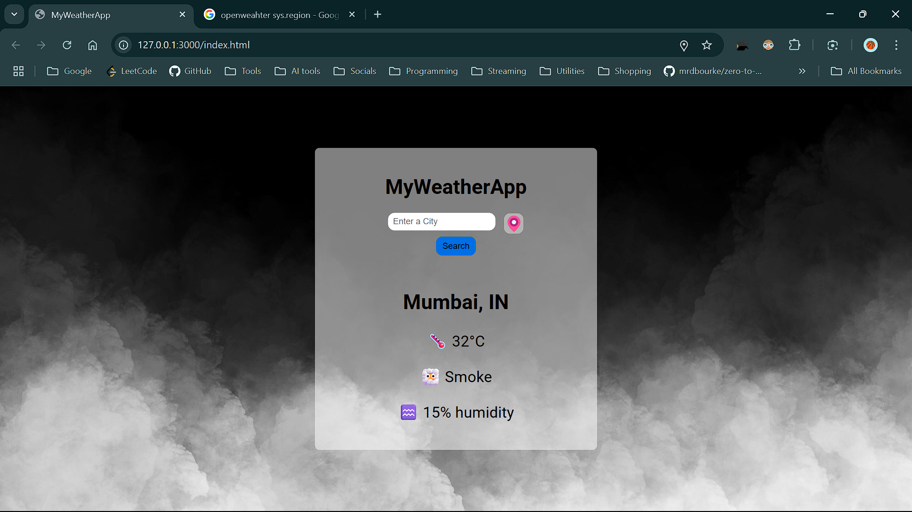

# MyWeatherApp

A simple and interactive weather application that provides real-time weather updates for any city or your current location.
## Live Link
https://amazing-marzipan-5202be.netlify.app/

## Features

- **Search by City**: Enter a city name to get current weather details.
    
    
- **Geolocation Support**: Use the location pin icon to fetch weather for your current location.

    
- **Dynamic Backgrounds**: The app background changes according to the current weather condition (e.g., Sunny, Cloudy, Mist).

    

    
- **Real-time Data**: Fetches live data including temperature and weather status.

## Technologies Used

- HTML5
- CSS3
- JavaScript (ES6+)
- [OpenWeatherMap API](https://openweathermap.org/) (for weather data)
- [BigDataCloud API](https://www.bigdatacloud.com/) (for reverse geocoding)

## Setup and Usage

1. Clone the repository or download the source code.
2. Open `index.html` in your web browser.
3. Enter a city name and click "Search" or click the location pin icon to use your current location.

## Note

This project uses API keys for OpenWeatherMap. Ensure you have a valid internet connection and Your system's location feature is turned on for the API requests to work.
